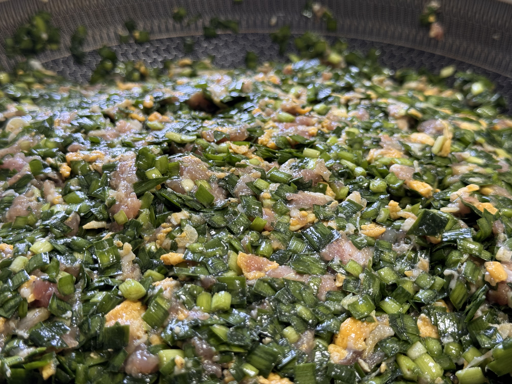
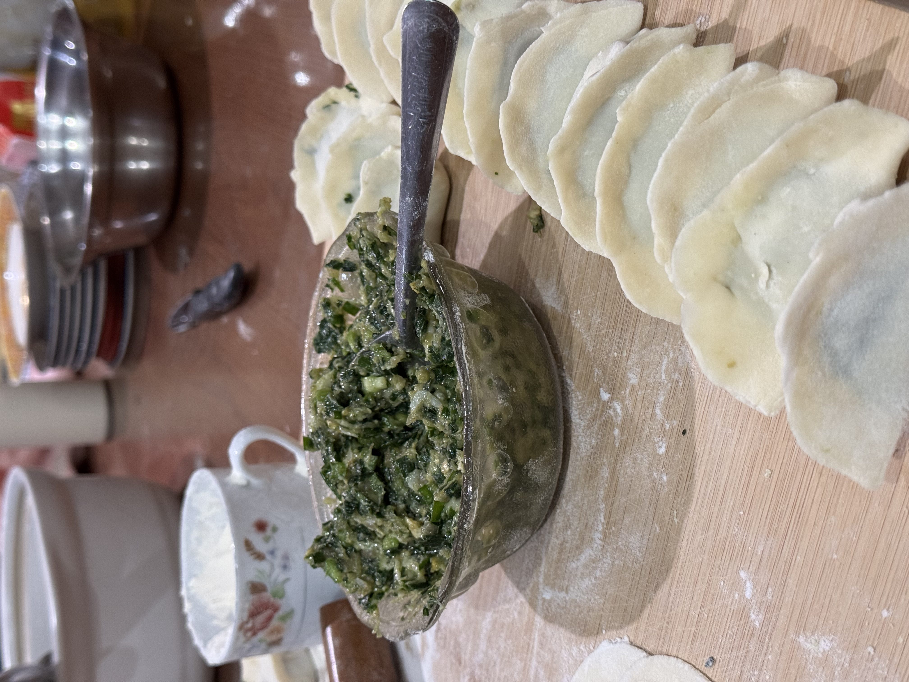

# 🥟 0 - 妈妈的韭菜鸡蛋饺子

### $\textcircled{1}$ 大火，煎
- 油（热锅热油）
- 鸡蛋液（4个）

### $\textcircled{2}$ 搅拌
- $\textcircled{1}$
- 韭菜（750g，切碎，吸干水）
- 虾米（2小包）
- 十三香（1/3小包）
- 盐（6小勺）
- 香油（50ml）
- 五花肉（750g，搅成肉馅）

### $\textcircled{3}$ 包饺子
- 饺子皮（大约能包200个）
- $\textcircled{2}$

